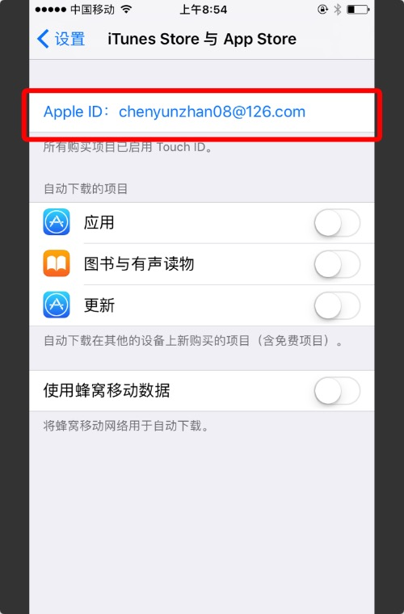

# 用户如何使用TestFlight进行测试

###此文档主要介绍公司内部如何使用TestFlight进行测试
##一，将你的apple id发送给开发者

apple id 是你在购买app或者激活iphone或者登录apple网站使用的邮箱。如果不清楚，可以在iphone这里进行查看：

##二，开发都给你发送测试邀请后，登录你的邮箱（就是apple id对应的邮箱），接受邀请。如下图：

======这时候你会收到一个验证码，请保留，下面会使用到=======

##三，在app store 下载 testflight,输入验证码，最后下载app,进行测试

======使用apple id 登录 testflight=======

